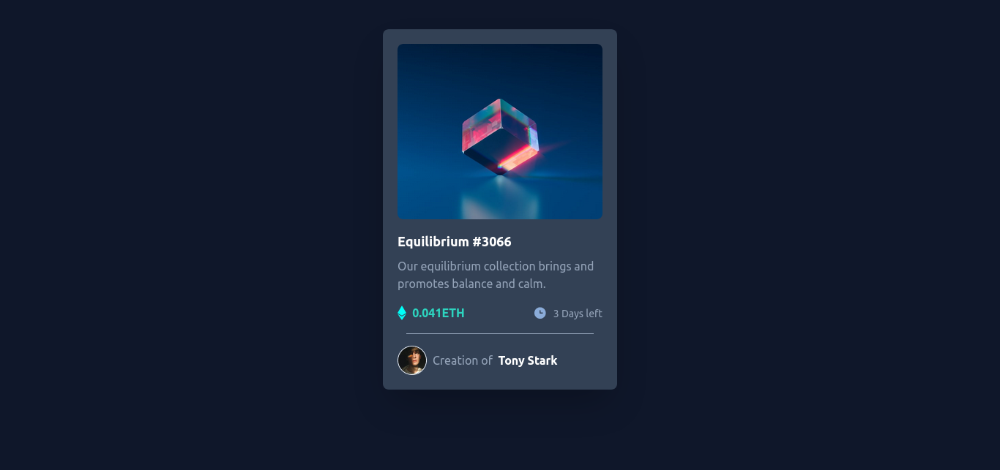

# Frontend Mentor - NFT preview card component

> by Aditya Kadalii

## Screenshots:

## Built with:

- Tailwind CSS
- Semantic HTML5

## Key Learnings:

In this project I learned to use tailwind css.

## Time taken:

- 2 hours

## Links:

- [Live demo](https://adityakadali.github.io/NFT-preview-card/src/index.html)
- [Source](https://github.com/Adityakadali/NFT-preview-card)
